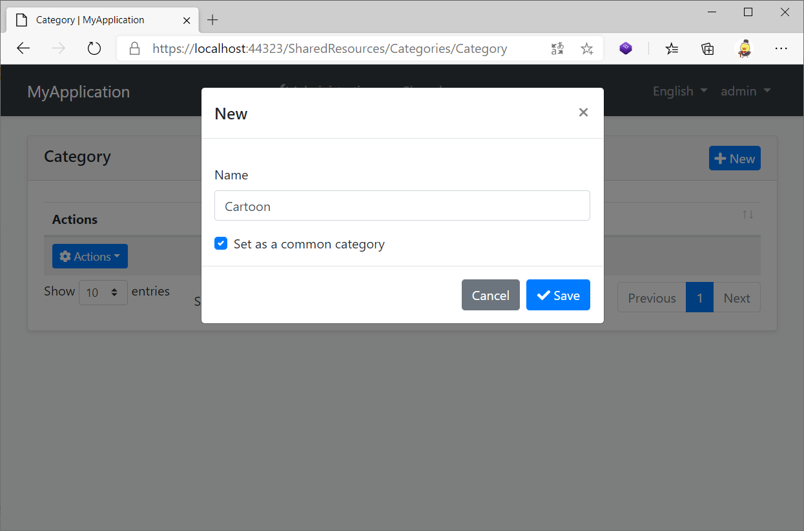
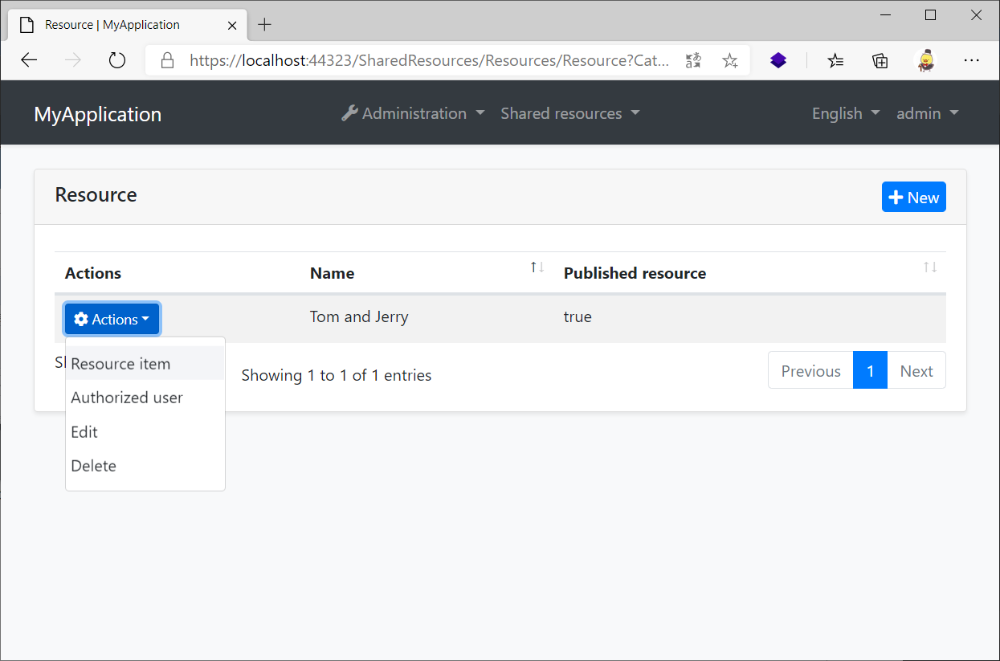
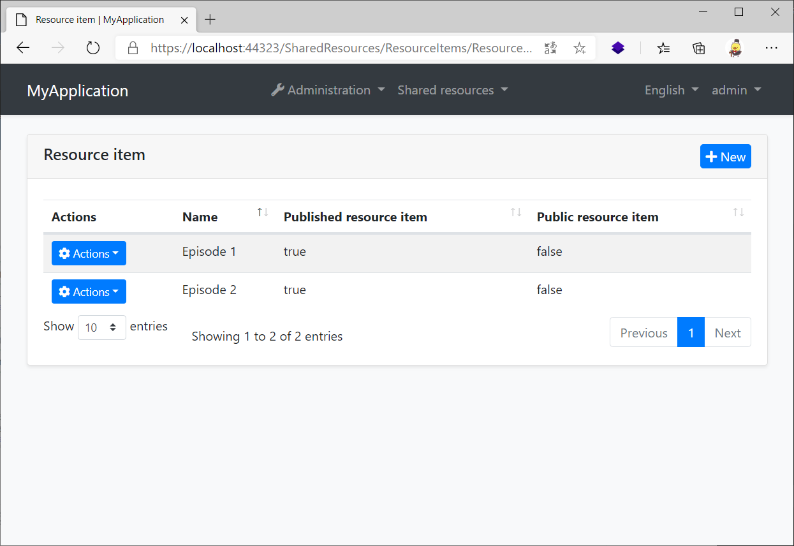

# SharedResources
An abp application module that allows users to share resources with each other.

## Getting Started

* Install with [AbpHelper](https://github.com/EasyAbp/AbpHelper.GUI)

    Coming soon.

* Install Manually

    1. Install `EasyAbp.SharedResources.Application` NuGet package to `MyProject.Application` project and add `[DependsOn(SharedResourcesApplicationModule)]` attribute to the module.

    1. Install `EasyAbp.SharedResources.Application.Contracts` NuGet package to `MyProject.Application.Contracts` project and add `[DependsOn(SharedResourcesApplicationContractsModule)]` attribute to the module.

    1. Install `EasyAbp.SharedResources.Domain` NuGet package to `MyProject.Domain` project and add `[DependsOn(SharedResourcesDomainModule)]` attribute to the module.

    1. Install `EasyAbp.SharedResources.Domain.Shared` NuGet package to `MyProject.Domain.Shared` project and add `[DependsOn(SharedResourcesDomainSharedModule)]` attribute to the module.

    1. Install `EasyAbp.SharedResources.EntityFrameworkCore` NuGet package to `MyProject.EntityFrameworkCore` project and add `[DependsOn(SharedResourcesEntityFrameworkCoreModule)]` attribute to the module.

    1. Install `EasyAbp.SharedResources.HttpApi` NuGet package to `MyProject.HttpApi` project and add `[DependsOn(SharedResourcesHttpApiModule)]` attribute to the module.

    1. Install `EasyAbp.SharedResources.HttpApi.Client` NuGet package to `MyProject.HttpApi.Client` project and add `[DependsOn(SharedResourcesHttpApiClientModule)]` attribute to the module.

    1. Install `EasyAbp.SharedResources.MongoDB` NuGet package to `MyProject.MongoDB` project and add `[DependsOn(SharedResourcesMongoDbModule)]` attribute to the module.

    1. (Optional) If you need MVC UI, install `EasyAbp.SharedResources.Web` NuGet package to `MyProject.Web` project and add `[DependsOn(SharedResourcesWebModule)]` attribute to the module.
    
    1. Add `options.ConventionalControllers.Create(typeof(SharedResourcesApplicationModule).Assembly);` to `Configure<AbpAspNetCoreMvcOptions>(options => { ... });` in your host module (It is usually Web project or HttpApi.Host project).
    
    1. Add `builder.ConfigureSharedResources();` to OnModelCreating method in `MyProjectMigrationsDbContext.cs`.

    1. Add EF Core migrations and update your database. See: [ABP document](https://docs.abp.io/en/abp/latest/Tutorials/Part-1?UI=MVC#add-new-migration-update-the-database).

## Usage

1. Add permissions to the roles you want.

1. Create a category.

1. Create a resource in the category.

1. Create a resource item in the resource.

1. Set authorized users of the resource so they can access it.

## Application Scenario

### Video Sharing Sites

* Enable users to create their own categories and resources.
* Enable users to decide who has access to resources.

### Free Download Sites

* Add categories with the `Set as a common category` configuration.
* Add resource items with the `Public resource item` configuration.

### Paid Knowledge Market

* Add categories with the `Set as a common category` configuration.
* Set the free part of resource items to `Public resource item`.
* Use [EShop](https://github.com/EasyAbp/EShop) module to sell your courses, when a user buys a course, give him access to related resources.

## Roadmap

- [ ] Explorer.
- [ ] Pages for admin to manage users' categories and resources.
- [ ] Unit tests.
